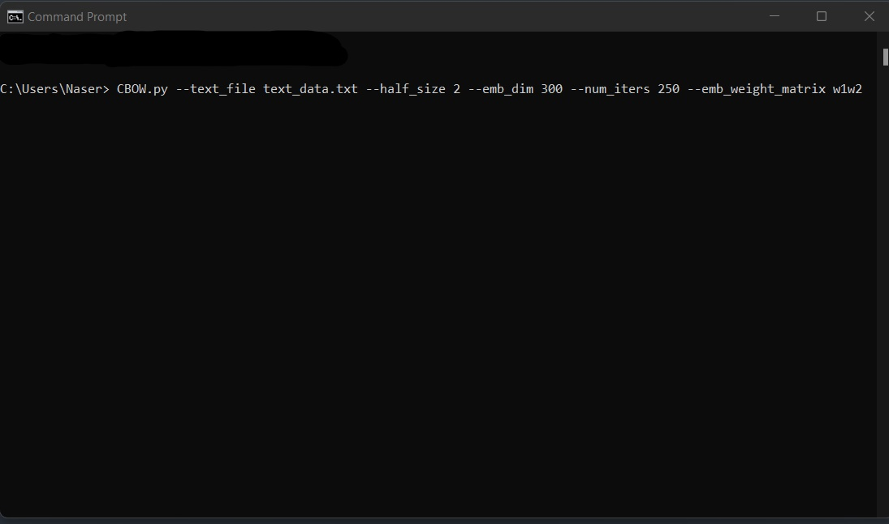

# Continuous-Bag-Of-Word-Embedding

This implementation is for learning purposes only, it may not be efficient as other official implementations 

<h1 align="center">Continuous Bag Of Words (CBOW) word embedding</h1>

This implementation is for learning purposes only, it may not be efficient as other official implementations 

This implementation words by executing the file in command line and it takes some argument that specified by the user. 

CGOW.py --text_file Path/to/text/file/contains/the/data --half_size int --emb_dim int --num_iters int --emb_weight_matrix one of the following ['w1', 'W1', 'w2', 'W2', 'w1w2', 'W1w2', 'w1W2', 'W1W2']

  

After executing the code a pkl file will be saved in your current working directory when you deserialize this file you will get a python dictionary that map each word to its embedding.  

The dir. naser is a python vertual environment 
